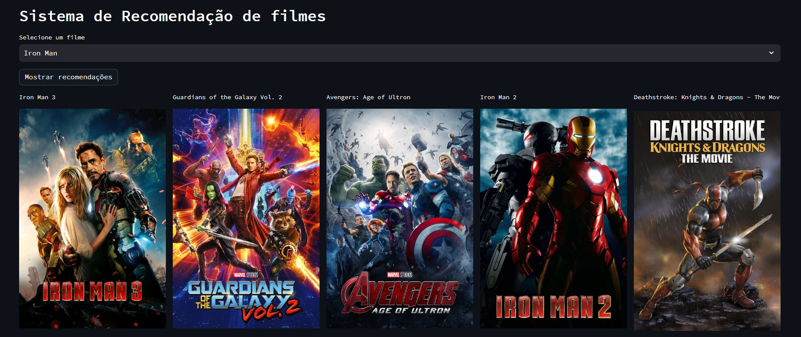

# Sistema de recomendação

## Introdução

Esse projeto tem como o objetivo me fazer aprofundar e praticar conceitos de ML.
Para esse projeto faremos um sistema de recomendação. Existem basicamente três tipos de sistemas de recomendação:
as
* Content-based filtering
* Collaborative filtering
* Hybrid

Neste projeto usaremos Content-based filtering o que significa que nosso sistema de recomendação vai levar em conta itens que o usuario tenha gostado anteriormente para fazer a indicação de novos itens para consumo. Esse modelo tem como problema principal o fato que não conseguimos indicar coisas muito diferentes que o nosso cliente pode gostar. Exemplificando, se um usuario consume apenas musicas no estilo samba, vamos indicar musicas com um estilo muito proximo o que pode ser ruim caso nosso usuario queria experimentar um novo estilo musical.

# Dados

Para esse projeto usaremos os dados disponibilizados pelo IMDB no seu site, vamos coletar esses dados diretamente da API aberta do site. Conseguimos coletar 10.000 filmes que farão parte do nosso projeto. Para obter acesso a API do IMDB basta acessar o [site](https://developer.themoviedb.org/reference/intro/getting-started) e criar um usuario e obter sua chave para fazer requisições a API.

# Construção do modelo

Para construir o modelo inicialmente tivemos que criar uma váriavel que chamamos de tags, basicamente essa variavel é a junção dos campos resumo, genero, idioma_originale lancamento. Tendo esse campo criamos vetores para cada uma dessas tags. Com esses vetores a gente conseguiu usar a função cosine_similarity que vê a distancia entre os vetores de tags, vendo quais os filmes tem as tags mais proximas. Assim conseguindo recomendar filmes que se parecem mais.

# Construção de aplicativo

Usamos a interface streamlit para criar e hospedar o nosso modelo que pode ser acessado utilizando o link do [app](https://sistema-de-recomendacao-5yaiio3r2v4.streamlit.app/)
Para utilizar o app basta selecionar o seu filme favorito e vai aparecer na tela 5 indicações que se parecem com o seu filme favorito.